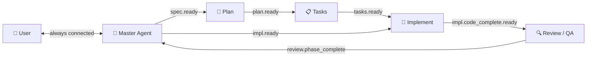
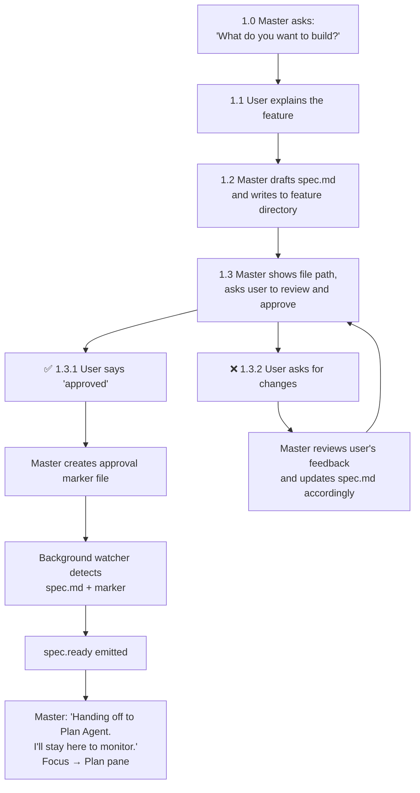
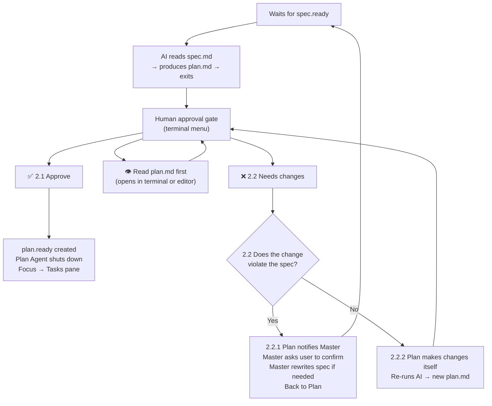
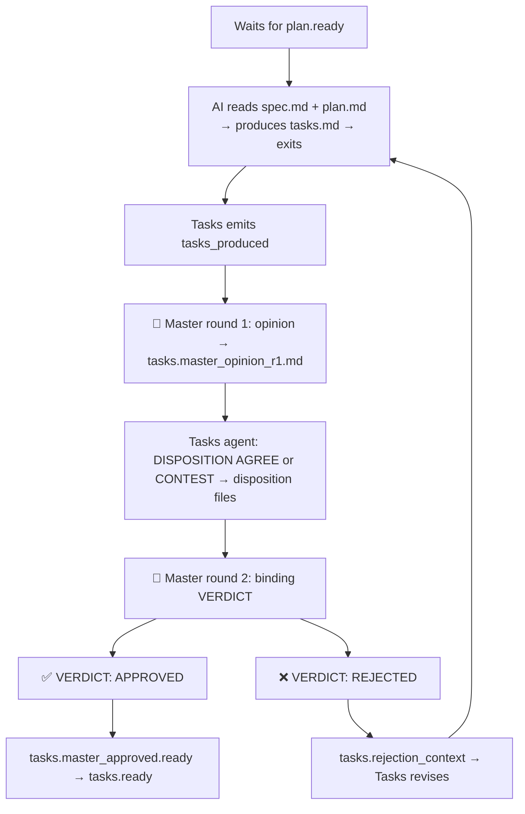
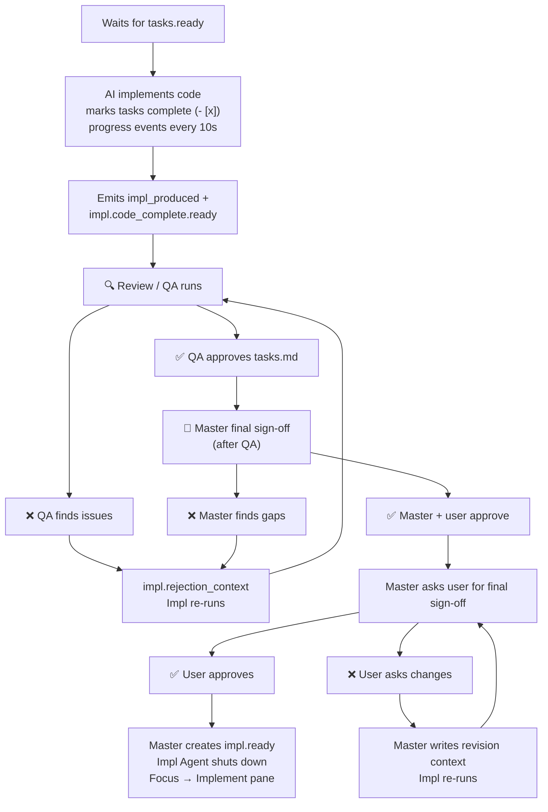
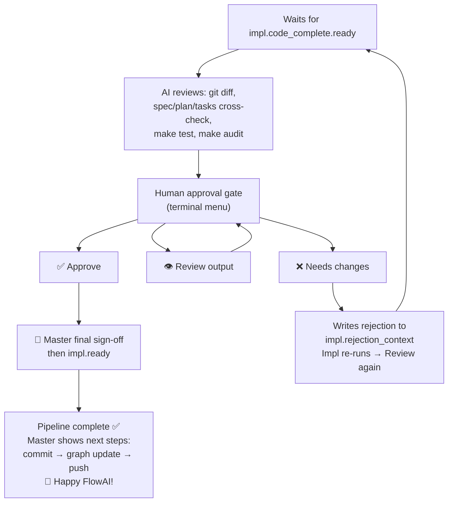
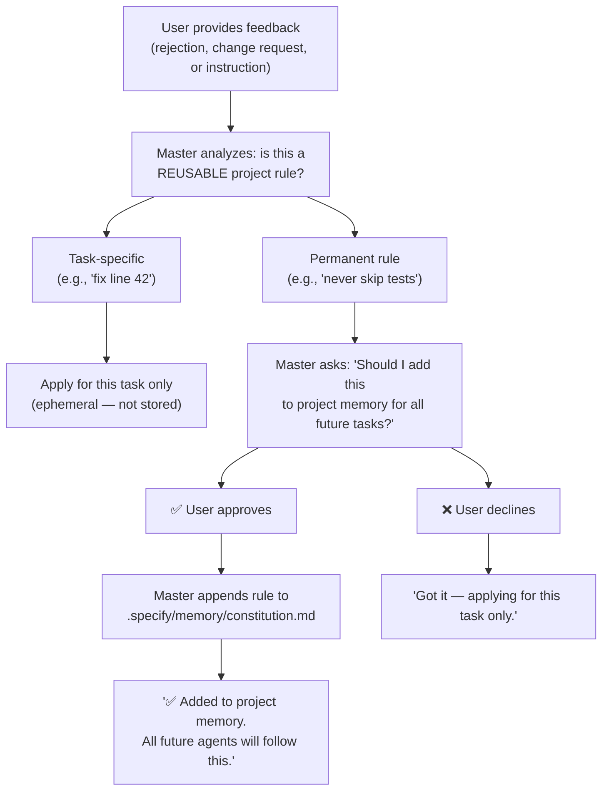

# Agent Communication & Phase Coordination

FlowAI orchestrates multiple AI agents in a tmux session. Each agent runs in
its own pane, working on a specific pipeline phase. This document describes how
agents communicate, pass data, and coordinate — and why the design is agnostic
of the specific AI tool, role, or skill assigned to each phase.

---

## Design Principles

1. **Phase scripts own the contract.** Every inter-agent handoff is managed by
   bash scripts in `src/phases/`. The role files (`src/roles/`) describe _what_
   the agent is; the phase scripts describe _when_ it starts, _what_ it reads,
   _where_ it writes, and _how_ it signals completion.

2. **Tool-agnostic.** Whether a phase runs Gemini, Claude, Cursor, or Copilot,
   the coordination logic is identical. The tool plugin (`src/tools/*.sh`) is
   only responsible for launching the AI CLI — it never touches signals, events,
   or artifact paths.

3. **Role-agnostic.** A user can create any custom role (e.g., `mobile-engineer.md`)
   and assign it to a phase in `config.json`. The pipeline will work without
   changes because the coordination preamble is injected at the prompt composition
   layer (`src/core/skills.sh`), not inside each role file.

4. **Skill-agnostic.** Skills are appended to prompts but play no part in
   signal coordination or data flow.

---

## Pipeline Overview

The Master Agent is the **central orchestrator** of the entire pipeline. All
downstream agents report to Master. Master controls phase transitions, reviews
artifacts, and is the single point of contact for the user.

### High-Level Flow



### Who approves what?

| Phase      | Artifact    | Approved by                 | How                                               |
| ---------- | ----------- | --------------------------- | ------------------------------------------------- |
| **Spec**   | `spec.md`   | 👤 **User**                 | Conversational — user says "approved" in the REPL |
| **Plan**   | `plan.md`   | 👤 **User**                 | Terminal menu — Approve / Review / Needs changes  |
| **Tasks**  | `tasks.md`  | 👑 **Master Agent**         | One-shot AI review — validates coverage + alignment |
| **Impl**   | source code | 👑 **Master** → 👤 **User** (after QA) | QA (Review) runs first; Master final sign-off last → `impl.ready` |
| **Review** | QA report   | 👤 **User**                 | Terminal menu — Approve / Review / Needs changes  |

---

### Step-by-step: what happens at each phase

---

### 0. Before the session — `flowai start` (trunk → feature)

When you run **`flowai start`** from a **trunk** branch (`main`, `master`, or `develop`), FlowAI runs the **feature wizard** before tmux:

1. **Fetch** `default_branch` from `origin` (from `.flowai/config.json`, set at `flowai init`).
2. **Check out** that branch locally (or create it from `origin/<default_branch>` when missing).
3. **Pull** fast-forward when possible so the new work branches from current remote head.
4. Ask for a **short feature description** (used to derive the **git branch name** and spec title).
5. **`git checkout -b <branch>`**, create **`specs/<branch>/spec.md`** from the **template** (starter content only — not final spec).
6. Start the **tmux** session. **Master** then drives **clarification and refinement** of `spec.md` (see below).

If you are **already on a feature branch** but `spec.md` is missing or empty, FlowAI offers to create the template before starting.

---

### 1. Master (Specification) — interactive

The user interacts with the Master Agent to define the feature.
**The user MUST explicitly approve** the spec before the pipeline advances.

**Where the conversation runs depends on the Master tool** (`.flowai/config.json` → `master.tool`):

| Tool | Where clarification happens | Notes |
| ---- | ----------------------------- | ----- |
| **Gemini / Claude** (CLI REPL) | In the **Master tmux pane** | Opening turn asks what to build; approval is conversational in that REPL. |
| **Cursor / Copilot** (paste-only) | In your **IDE** after you paste the system prompt | There is **no** long-running chat in the pane — FlowAI prints the prompt, then **waits** for `spec.md` **plus** the approval marker (see below) before showing the **manual** Approve / Needs changes menu. Clarification = your session in Cursor/Copilot, following the same OPENING TURN rules in the injected prompt. |

A **background watcher** polls for **non-empty `spec.md`** and **`.flowai/signals/spec.user_approved`**. When both exist, it emits **`spec.ready`** and Plan unblocks. Do **not** kill that wait early: paste-only tools used to drop straight into the gum menu; that is incorrect for the intended “clarify first, approve later” flow.



**What happens on ✅ Approve (1.3.1):**

1. User says "approved", "go ahead", or "looks good" in the REPL
2. The AI creates a marker file at `.flowai/signals/spec.user_approved`
3. A background watcher (running since session start) detects **both** `spec.md` and the marker
4. `spec.ready` signal is emitted → Plan phase unblocks
5. Master says: _"I'll hand it over to Plan Agent. I'll stay here to monitor the process."_
6. Tmux focus automatically switches to the Plan pane
7. Master stays alive → enters Phase 2 (active pipeline orchestration)

**What happens on ❌ Reject (1.3.2):**

1. User asks for changes: _"Add more details about authentication"_ or _"I don't like approach X"_
2. Master Agent **reviews the user's feedback**, analyzes what needs to change
3. Master applies the requested changes to `spec.md` according to user's needs
4. Master shows the updated file path and asks for approval again
5. **This loops until the user explicitly approves** — the pipeline does NOT advance

> **Key:** The user never exits the REPL. The approval is purely conversational.
> The AI writes a marker file only when the user gives explicit consent.

---

### 2. Plan (Architecture) — oneshot

The Plan Agent produces an architecture plan based on the approved spec.
**The user approves the plan** via a terminal menu.



**What does 👁️ "Read plan.md first" do?**

This is NOT a decision — it simply lets you **read the plan before deciding**.
The terminal menu offers two reading modes:

- **Read here (Terminal)** — shows `plan.md` in a scrollable pager right in the terminal
- **Open in Editor** — opens `plan.md` in your `$EDITOR` (e.g., Cursor, VS Code, vim)

After you finish reading, the menu appears again so you can choose Approve or Needs changes.

**What happens on ✅ Approve (2.1):**

1. User selects "Approve" from the terminal menu
2. `plan.ready` signal is created
3. Plan Agent emits `phase_complete` event and shuts down
4. Master detects the event, prepares context for Tasks
5. Focus automatically switches to the Tasks pane

**What happens on ❌ Reject (2.2):**

Two sub-scenarios:

- **2.2.1 — Change violates the original spec:** The Plan Agent notifies the Master
  with the conflict. Master analyzes it, asks the user to confirm. If confirmed,
  Master rewrites `spec.md`, re-approves, then runs Plan again from scratch.

- **2.2.2 — Normal change:** The Plan Agent makes the change itself, re-runs the AI
  to produce a revised `plan.md`, and presents the approval menu again. This loops
  until the user approves.

---

### 3. Tasks (Breakdown) — two-round Master review, then Master-approved

The Tasks Agent breaks the plan into implementable tasks. **The Master Agent** runs a
**two-round** review (velocity + fairness): round 1 is a non-binding opinion; the Tasks
agent **AGREE**s or **CONTEST**s with a valid reason; round 2 is the **binding VERDICT**.
No separate human approval gate for tasks.



**Round 1 — Master opinion (non-final):**

1. Master detects `tasks_produced`, clears prior review artifacts, runs a one-shot AI call that **must not** emit `VERDICT`; output is saved to `tasks.master_opinion_r1.md`.

**Tasks disposition:**

2. Tasks phase sees the opinion file and runs a one-shot call: last line `DISPOSITION: AGREE — …` or `DISPOSITION: CONTEST — …` (contest must cite spec/plan). Writes `tasks.task_disposition.md` and touches `tasks.task_disposition_done`.

**Round 2 — Master final VERDICT:**

3. Master runs a one-shot with round-1 opinion, disposition, and spec/plan/tasks. Last line: `VERDICT: APPROVED` or `VERDICT: REJECTED — …`.
4. On **APPROVED**: Master creates `tasks.master_approved.ready` → Tasks touches `tasks.ready`, emits `phase_complete`, and the **Tasks** pane/window may **auto-close** (same mechanism as Plan) so Master + Implement keep space.
5. On **REJECTED**: Master writes `tasks.rejection_context`; Tasks revises and emits a new `tasks_produced` — loop until approval.

**Escalation (deadlock breaker):** If Master issues **REJECT** on round 2 repeatedly, FlowAI counts consecutive rejections in `tasks.dispute_round`. After **`FLOWAI_TASKS_MAX_DISPUTE_ROUNDS`** (default **3**) such verdicts, Master **force-approves** tasks: it touches `tasks.master_approved.ready`, appends a short “Master escalation” section to `tasks.md`, and emits `tasks_escalated` so Implement can proceed. Set the env var to raise or lower the threshold.

If you **interrupt** the Tasks phase (e.g. Ctrl+C), run `touch .flowai/signals/tasks.master_approved.ready` after fixing `tasks.md`, or run `flowai run tasks` again; Master logs the same recovery hint when it sees a `phase_aborted` event.

> **Why no human gate?** The user already approved the spec and plan, and Master
> performs a genuine AI semantic review — not just an existence check. This keeps
> velocity high while ensuring alignment.

---

### 4. Implement — oneshot, stays alive for revisions

The Implement Agent writes source code. It **stays alive** after completion
so Master can request revisions without restarting.



**Order:** Implement finishes → **Review (QA)** runs on `impl.code_complete.ready` → when QA approves, **Master** runs the **final** binding review (**oneshot** in the Master pane, so output appears without an empty REPL) → **gum** approval menu → `impl.ready` → Implement exits.

**What happens on ✅ Master final sign-off → ✅ User Approve:**

1. After QA has approved (Review emits `phase_complete`), Master runs a **non-interactive** Gemini oneshot with the post-QA prompt (required headings: **`## Master — review plan`**, **`## Master — findings`**).
2. The **terminal menu** (`flowai_phase_verify_artifact`) asks you to approve the implementation; on **Approve**, FlowAI touches `impl.ready`.
3. Impl Agent detects `impl.ready` → shuts down cleanly
4. Focus switches to the Implement pane (so you see the phase exit)

**What happens on ❌ QA or Master revision (before `impl.ready`):**

1. Review AI or QA gate may write `impl.rejection_context`, or Master writes it after final review
2. Impl Agent detects the file → re-runs AI with only the failing items
3. Impl emits `impl_produced` again and re-touches `impl.code_complete.ready` → QA can run again
4. Loops until QA then Master approve

**What happens on ❌ User Reject at Master final gate:**

1. User asks for changes: _"Also handle the edge case for X"_
2. Master analyzes the request — asks user for clarification if unclear
3. Master writes revision context → Impl Agent re-runs
4. After revision → QA then Master final review again
5. Loops until user approves

---

### 5. Review (QA) — oneshot

The Review Agent performs a final quality check on all code changes.

**Why does the gum menu mention `tasks.md`?** The Review AI works in the **repository** (e.g. `git diff`, tests, linters) per `reviewer.md` and the phase directive. The pipeline still needs **one concrete file path** for the human gate (`flowai_phase_run_loop` → `flowai_phase_verify_artifact`) and for “open in editor” — FlowAI uses **`tasks.md`** as that shared **checklist anchor** (the same file Implement tracks). You are **not** being asked to QA only the markdown task list; use the menu to confirm QA of the **implementation** after the agent has run.



**What happens on ✅ Approve:**

1. User selects "Approve" from the terminal menu
2. `review.phase_complete` event is emitted
3. The **Review** pane/window may **auto-close** (dashboard/tabs), same as Plan — **Master** and **Implement** stay open.
4. **Master** runs the post-QA binding review (**oneshot**), then the **gum** menu for final implementation approval → `impl.ready`.
5. After `impl.ready`, Master shows next steps and _"🎉 Happy FlowAI! Feature complete."_

> **Why not auto-update the graph here?** The knowledge graph mines **git history**
> (commit messages, file hashes, provenance). Updating before commit would index
> uncommitted changes that the user might still revert — a hallucination risk.
> The graph should only reflect committed, intentional code.

**What happens on ❌ Reject:**

1. Review Agent writes structured rejection to `impl.rejection_context`
2. Master detects the rejection event and provides guidance
3. Impl Agent re-runs with only the failing items
4. Review runs again after Impl completes
5. Loops until the user approves the review

---

### Rejection Flow Summary

| Phase  | Rejected by              | What happens next                                              |
| ------ | ------------------------ | -------------------------------------------------------------- |
| Spec   | 👤 User (in REPL)        | Master revises `spec.md`, asks user again                      |
| Plan   | 👤 User (terminal menu)  | Plan self-corrects **or** escalates to Master if spec conflict |
| Tasks  | 👑 Master Agent          | Master writes revision context, Tasks re-runs                  |
| Impl   | 👑 Master **or** 👤 User | Master writes `impl.rejection_context`, Impl re-runs           |
| Review | 👤 User (terminal menu)  | Master + Impl re-engage, Review runs again                     |

## Communication Mechanisms

### Event log: canonical `phase` field

JSONL events use the **pipeline phase id** (lowercase: `plan`, `tasks`, `review`, …), not the human display label (`Plan`). This keeps `grep` filters, `plan.revision.ready`, and Master orchestration aligned on all platforms (case-sensitive filesystems included).

### 1. Signal Files (`.flowai/signals/*.ready`)

Signals are the primary inter-phase synchronisation mechanism. Each downstream
phase blocks on its upstream signal before starting.

| Signal File                   | Created By                                                   | Consumed By                               |
| ----------------------------- | ------------------------------------------------------------ | ----------------------------------------- |
| `spec.ready`                  | Master (after user approves spec in REPL)                    | Plan phase                                |
| `plan.ready`                  | Plan phase (after user approves `plan.md` via gum gate)      | Tasks phase                               |
| `tasks.ready`                 | Tasks phase (after **Master Agent** AI review approves)      | Implement phase                           |
| `tasks.master_approved.ready` | Master Agent (round-2 binding VERDICT APPROVED)               | Tasks phase (poll)                      |
| `tasks.master_opinion_r1.md`  | Master Agent (round-1 opinion text)                           | Tasks phase (disposition prompt)         |
| `tasks.task_disposition.md`   | Tasks phase (AGREE/CONTEST response)                          | Master Agent (round-2 prompt)            |
| `tasks.task_disposition_done` | Tasks phase (touch after disposition)                         | Master Agent (triggers round 2)          |
| `tasks.r2_complete`           | Master Agent (after round-2 VERDICT processed)                | Internal (idempotency)                   |
| `impl.code_complete.ready`    | Implement (when implementation output is ready for QA)      | Review phase                              |
| `impl.ready`                  | Master (after QA + Master final sign-off + user approval)    | Implement phase (exit)                    |
| `spec.user_approved`          | AI agent (when user says "approved" in REPL)                 | Master watcher                            |

**Rejection & revision signals:**

| Signal File                   | Created By                              | Consumed By                            |
| ----------------------------- | --------------------------------------- | -------------------------------------- |
| `tasks.rejection_context`     | **Master Agent** (on tasks AI review rejection) | Tasks phase (triggers retry loop)      |
| `<phase>.reject`              | `verify_artifact` on reject             | Informational (cleaned up on revision) |
| `<phase>.revision.ready`      | **Master Agent** (auto, after guidance) | The rejected phase (unblocks retry)    |

> **Automatic revision signalling:** After a downstream phase is rejected,
> `flowai_phase_run_loop` waits for `<phase>.revision.ready` before retrying.
> The Master Agent **automatically creates this signal** after providing
> guidance — no manual command needed. The flow is:
>
> 1. Phase rejected → Master detects rejection event
> 2. Master re-engages AI with rejection context
> 3. Master provides guidance through the REPL
> 4. Master auto-creates `<phase>.revision.ready` → blocked phase unblocks
>
> This is fully managed by the orchestrator — the user never needs to
> run manual commands.

**How it works:**

```bash
# Downstream phase blocks here until the signal exists:
flowai_phase_wait_for "spec" "Plan Phase"
#   → polls for .flowai/signals/spec.ready every 2 seconds

# Signal is created by flowai_phase_verify_artifact() when human approves:
#   → touch "$SIGNALS_DIR/${signal}.ready"
```

Most approval signals are created by `flowai_phase_verify_artifact()` in
`src/core/phase.sh`. **Exception:** Implement touches `impl.code_complete.ready`
when code is ready for QA so Review does not block on `impl.ready` (which is only
created after QA and Master final sign-off).

### 2. Artifact Files (`specs/<branch>/*.md`)

Phases communicate data by writing to and reading from shared artifact files in
the feature directory.

| Artifact   | Written By | Read By                   |
| ---------- | ---------- | ------------------------- |
| `spec.md`  | Master     | Plan, Tasks, Impl, Review |
| `plan.md`  | Plan       | Tasks, Impl, Review       |
| `tasks.md` | Tasks      | Impl, Review              |

Each phase script's `DIRECTIVE` variable tells the AI agent:

- **CONTEXT** — which upstream artifacts to read (absolute paths)
- **OUTPUT FILE** — where to write the output (absolute path)

Example from `plan.sh`:

```bash
DIRECTIVE="IMPORTANT PIPELINE DIRECTIVE:
You are assigned to Phase: Plan (Architecture).
Your WORKING DIRECTORY is: $PWD

CONTEXT — read the following upstream artifact before starting:
  $FEATURE_DIR/spec.md

OUTPUT FILE — you MUST write your artifact to this exact path:
  $FEATURE_DIR/plan.md"
```

### 3. Event Log (`.flowai/events.jsonl`)

A shared, append-only JSONL file that gives all agents visibility into pipeline
activity. Each event has the format:

```json
{ "ts": "2026-04-12T06:30:00Z", "phase": "plan", "event": "started", "detail": "Beginning AI run" }
```

**Event types:**

| Event               | Meaning                                       |
| ------------------- | --------------------------------------------- |
| `waiting`           | Phase is blocked, waiting for upstream signal |
| `started`           | Phase AI run has begun                        |
| `artifact_produced` | Phase output file written                     |
| `approved`          | Human approved the artifact                   |
| `rejected`          | Human rejected the artifact                   |
| `progress`          | Implementation progress (e.g., "3/7 tasks")   |
| `phase_complete`    | Phase fully done (approved + signal fired)    |
| `pipeline_complete` | All phases done                               |

The event log is injected into every agent's prompt as `[PIPELINE EVENT LOG]`
so agents can understand what other agents have done.

### 4. Rejection Context File

When the Review phase finds issues, it writes structured feedback to:

```
.flowai/signals/impl.rejection_context
```

On re-run, the Implement phase reads this file and focuses only on the
failing items instead of re-implementing everything.

### 5. Knowledge Graph (`.flowai/wiki/`)

The knowledge graph is a compiled map of the entire codebase — entities,
relationships, communities, and provenance. It is **automatically injected
into every agent's prompt** as a `[FLOWAI KNOWLEDGE GRAPH]` block.

**What the graph provides to agents:**

| Resource      | Path                           | Purpose                                            |
| ------------- | ------------------------------ | -------------------------------------------------- |
| Graph Report  | `.flowai/wiki/GRAPH_REPORT.md` | God nodes, community summaries, suggested queries  |
| Machine Graph | `.flowai/wiki/graph.json`      | Nodes, edges, provenance — for multi-hop reasoning |
| Index         | `.flowai/wiki/index.md`        | Full catalog of wiki pages with one-line summaries |

**How agents use it:**

```
1. Read GRAPH_REPORT.md before searching any files
2. Use index.md to find the exact wiki page for any concept
3. Use graph.json for multi-hop reasoning (dependencies, call chains)
4. Only read raw source files when the graph points to a specific location
```

**When it is injected:** Layer 4 of the prompt composition stack in
`flowai_skills_build_prompt()` — after the Pipeline Coordination preamble
and Project Constitution, but before the Event Log and Skills.

**When to update it:** After the user **commits** their changes. The graph
mines git history (commit messages, file hashes), so it must only reflect
committed, intentional code. Run `flowai graph update` after `git commit`.

> **Why not auto-update during the pipeline?** Uncommitted code may be
> reverted. Indexing it would create hallucination risk — the graph would
> reference code that no longer exists.

---

### 6. Adaptive Memory Learning

The Master Agent can learn from user feedback and persist reusable rules to
the project's memory (constitution file). This is **user-gated** — the Master
never writes to memory without explicit approval.

**Where memory lives:**

```
.specify/memory/constitution.md    ← Layer 3 of every agent's prompt
```

Any rule added here is automatically injected into every agent's prompt on
the next pipeline run — no code changes needed.

**How it works:**



**Examples:**

| User says | Type | Master action |
|-----------|------|---------------|
| "Never skip creating tests" | ✅ Permanent rule | Ask to persist |
| "Always use dependency injection" | ✅ Permanent rule | Ask to persist |
| "Use PostgreSQL, not SQLite" | ✅ Permanent rule | Ask to persist |
| "Add more details about auth" | ❌ Task-specific | Apply now only |
| "Fix the typo on line 42" | ❌ Task-specific | Apply now only |

> **Safety:** Memory is **append-only** and **user-gated**. The Master Agent
> NEVER modifies the constitution without explicit user approval. This prevents
> hallucinated rules from polluting the project memory.

---

## Phase Lifecycle (How Each Phase Runs)

### Downstream Phases (plan, review)

Plan and Review follow the standard lifecycle via `flowai_phase_run_loop()`:

```
┌─────────────────────────────────────────────────────┐
│ 1. Wait for upstream signal                         │
│ 2. Resolve feature directory, role prompt           │
│ 3. Compose DIRECTIVE with absolute paths            │
│ 4. Enter run loop:                                  │
│    ┌───────────────────────────────────────────┐    │
│    │ a) AI run (dispatched to tool plugin)     │    │
│    │ b) Verify artifact exists                 │    │
│    │ c) Human approval gate (gum/read)         │    │
│    │    → Approve: emit signal, break          │    │
│    │    → Retry:   loop back to (a)            │    │
│    │    → Reject:  wait for revision signal    │    │
│    └───────────────────────────────────────────┘    │
│ 5. Emit phase_complete event                        │
└─────────────────────────────────────────────────────┘
```

### Tasks Phase (Master AI-reviewed, retry loop)

Tasks follows a different pattern — Master Agent reviews via one-shot AI call:

```
┌─────────────────────────────────────────────────────┐
│ 1. Wait for plan.ready                              │
│ 2. AI produces tasks.md                             │
│ 3. Emit "tasks_produced" event                      │
│ 4. Poll for Master decision:                        │
│    → tasks.master_approved.ready → approve + exit   │
│    → tasks.rejection_context → read context,        │
│      re-run AI with revision instructions, goto 3   │
│ 5. On approve: emit tasks.ready + phase_complete    │
└─────────────────────────────────────────────────────┘
```

> **Fail-closed design:** If Master's one-shot AI review fails (tool error,
> timeout), it defaults to `REJECTED` — never silently auto-approves.

### Implement Phase (stays alive)

Implement runs once then waits for Master's lifecycle signals:

```
┌─────────────────────────────────────────────────────┐
│ 1. Wait for tasks.ready                             │
│ 2. AI implements code, marks tasks complete         │
│ 3. Emit "impl_produced" + touch impl.code_complete  │
│ 4. Stay alive — poll for:                           │
│    ┌───────────────────────────────────────────┐    │
│    │ → impl.ready exists? → exit cleanly       │    │
│    │ → impl.rejection_context exists?          │    │
│    │   → re-run AI with revision context       │    │
│    │   → emit "impl_produced" again → loop     │    │
│    └───────────────────────────────────────────┘    │
└─────────────────────────────────────────────────────┘
```

### Master Phase (central orchestrator)

```
┌─────────────────────────────────────────────────────────┐
│ Phase 1: Interactive Spec Creation                      │
│ 1. Resolve role, feature directory                      │
│ 2. DIRECTIVE includes APPROVAL PROTOCOL                 │
│ 3. Background watcher: polls for spec.md + marker       │
│ 4. Interactive AI session (REPL)                        │
│    → User defines spec → AI writes spec.md               │
│    → User approves → AI creates approval marker         │
│    → Watcher detects both → emits spec.ready            │
│                                                         │
│ Phase 2: Active Orchestration (after spec approved)     │
│ 5. Monitor event log every 5 seconds                    │
│    → plan.phase_complete → focus to Tasks pane          │
│    → tasks_produced → Master one-shot AI review       │
│    → review.phase_complete → Master final sign-off →    │
│      impl.ready → pipeline_complete / celebration       │
│    → rejection → re-engage AI with context              │
└─────────────────────────────────────────────────────────┘
```

> [!WARNING]
> **`flowai run spec` vs Master:** Both can produce `spec.md` and emit
> `spec.ready`. Do not run `flowai run spec` concurrently with a `fai start`
> session — they will race on the same artifact and approval gate.

---

## Prompt Composition Stack

Every agent's prompt is assembled by `flowai_skills_build_prompt()` in
`src/core/skills.sh`. The composition order is:

```
1. Role file content        (e.g., src/roles/backend-engineer.md)
2. Pipeline Coordination    (auto-injected, role-agnostic preamble)
3. Project Constitution     (.specify/memory/constitution.md)
4. Knowledge Graph context  (if enabled)
5. Pipeline Event Log       (recent events from events.jsonl)
6. Assigned Skills          (SKILL.md files for the role)
```

Layer 2 (Pipeline Coordination) is the key to agnosticism — it is injected
into **every** agent prompt regardless of role, skill, or tool. It tells the
agent:

- The phase script handles signal waiting — the agent does not check signals
- All artifact paths are in the PIPELINE DIRECTIVE section
- The orchestrator handles artifact verification and approval

This means a user can create a brand new role file (e.g., `ios-engineer.md`)
with zero knowledge of FlowAI internals and it will work correctly in the
pipeline.

---

## Adding a New Phase

1. Add the phase name to `FLOWAI_PIPELINE_PHASES` in `src/core/phases.sh`
2. Create `src/phases/<name>.sh` following the standard lifecycle:
   ```bash
   flowai_phase_wait_for "<upstream_signal>" "<My Phase>"
   FEATURE_DIR="$(flowai_phase_resolve_feature_dir)"
   ROLE_FILE="$(flowai_phase_resolve_role_prompt "<name>")"
   DIRECTIVE="..."
   INJECTED_PROMPT="$(flowai_phase_write_prompt "<name>" "$ROLE_FILE" "$DIRECTIVE")"
   flowai_phase_run_loop "<name>" "$INJECTED_PROMPT" "$artifact" "$label" "$signal"
   ```
3. That's it — `start.sh`, `eventlog.sh`, and `bin/flowai` all read from the
   canonical phase list automatically.

## Adding a New Tool

1. Create `src/tools/<name>.sh` with the required plugin API:
   - `flowai_tool_<name>_run(model, auto_approve, run_interactive, sys_prompt)`
   - `flowai_tool_<name>_print_models()`
   - `flowai_tool_<name>_run_oneshot(model, prompt_file)`
2. Add the tool to `models-catalog.json`
3. That's it — `ai.sh` discovers plugins dynamically via `src/tools/*.sh` glob.

## Adding a New Role

1. Create a markdown file (e.g., `src/roles/ios-engineer.md`) describing the
   agent's domain responsibilities.
2. Do NOT include pipeline coordination, signal paths, or directive references —
   those are injected automatically by the prompt composition layer.
3. Assign the role to a phase in `.flowai/config.json`:
   ```json
   { "pipeline": { "impl": "ios-engineer" } }
   ```
