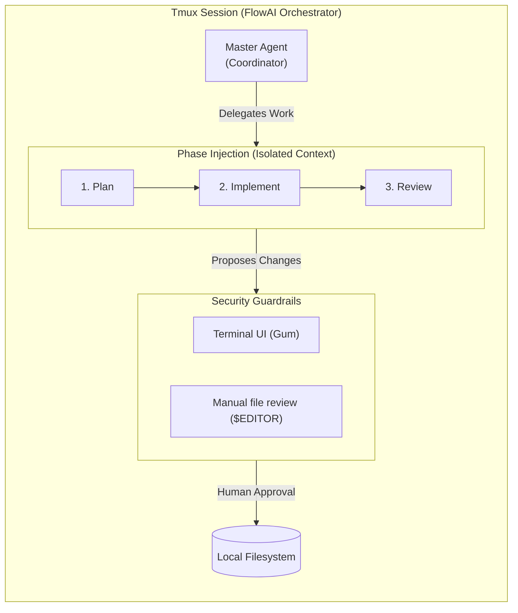
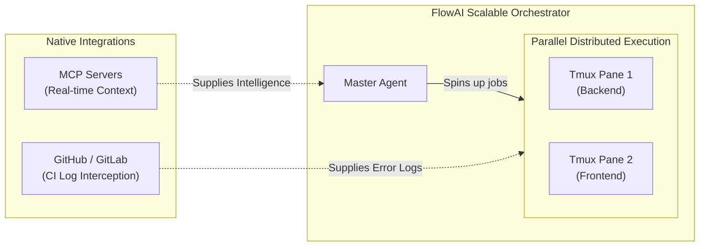

# FlowAI Architecture Blueprint

FlowAI is built on **Domain-Driven Design (DDD)** and the Unix philosophy. It aggressively isolates the orchestration engine (the driver) from the vendor tools (the implementers).

## The Orchestration Loop

Currently, FlowAI operates inside a `tmux` session. 

1. **The Master Agent**: Governs the core terminal window, deciding which phase to execute next.
2. **Phase Injection**: Standard Bash files (like `plan.sh` and `implement.sh`) receive isolated prompts and execute strictly constrained loops.
3. **Guardrails**: No AI agent is permitted to hijack the editor or UI natively. Output is verified strictly through `$EDITOR` via explicit terminal approval mechanisms (`gum pager`).

---

## Evolution Roadmap

FlowAI is designed toward enterprise-grade scaling. The following modules form the core of our mid-term architectural evolution:

### 1. Model Context Protocol (MCP) Integration
Instead of injecting monolithic text prompts dynamically through Bash processing, FlowAI will intercept native [Model Context Protocol (MCP)](https://github.com/microsoft/model-context-protocol) services.
- **Goal**: Allow the Planning phase to query an MCP endpoint for localized architectural context (e.g., retrieving exact TypeScript AST structures natively before proposing edits).
- **Wiring**: Future `flowai.json` configurations will define `mcp_servers` that `run.sh` bounds to the session context cleanly.

### 2. Version Control System (VCS) Integrations
The orchestrator must break beyond local filesystems and map seamlessly to automated continuous deployments.
- **Goal**: Full integration with **GitHub PRs** and **GitLab MRs**.
- **Wiring**: The Spec Kit (`.specify/`) currently scaffolds features. FlowAI will expand internal phases (`flowai run review`) to pull isolated CI logs from GitHub Actions directly into the Terminal for the AI implementation layer to automatically revise broken commits.

### 3. Distributed Parallel DAG Phases
Currently, FlowAI operates in a strict procedural loop (Plan -> Implement -> Verify).
- **Goal**: Break large features into decoupled dependency graphs.
- **Wiring**: Future orchestrator versions will support spinning up localized `tmux` windows operating concurrently on distinct features, merging their Git states safely before the final Review phase.
