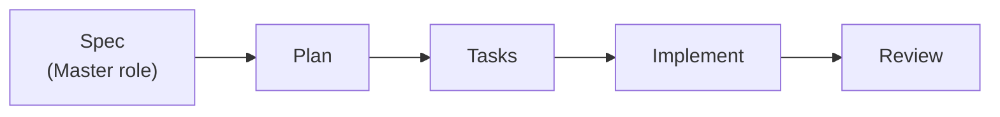
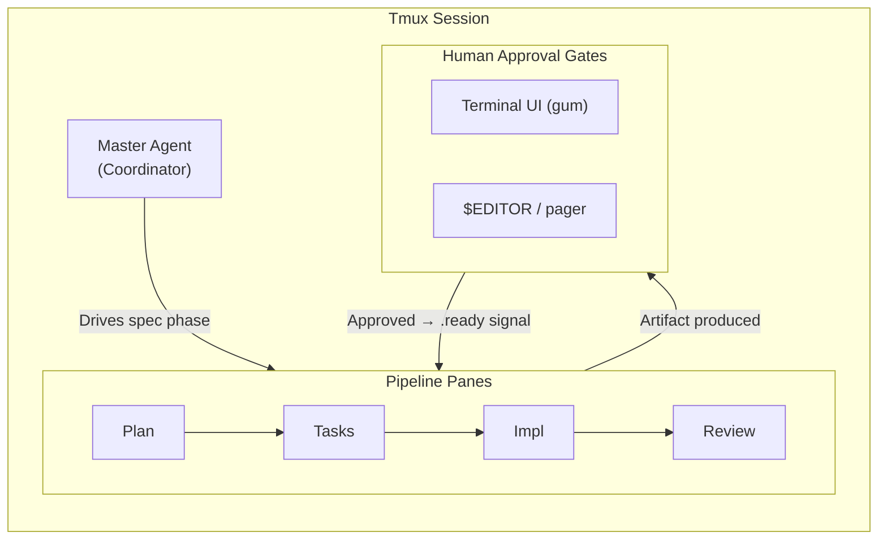

# FlowAI Architecture

FlowAI is built on the Unix philosophy and Domain-Driven Design. The orchestration engine is intentionally decoupled from vendor AI tools — adding a new tool touches only two files.

## Pipeline



Each phase runs in its own tmux pane, waits for the upstream `.ready` signal, invokes the AI, then blocks for human approval before emitting its own `.ready` signal.

## Session Layout



## Tool Plugin System

AI tools are self-contained plugins in `src/tools/<name>.sh`. Each plugin defines two functions:

- `flowai_tool_<name>_print_models()` — used by `flowai models list`
- `flowai_tool_<name>_run()` — called by the phase dispatcher in `src/core/ai.sh`

The dispatcher uses `declare -F` to resolve the function dynamically — no hardcoded tool list exists anywhere in the engine. Adding a new tool requires only:

1. `src/tools/<name>.sh` with both plugin functions
2. An entry in `models-catalog.json` with a `default_id` and `models[]` list

Test `UC-CLI-033` enforces this contract on every CI run.

## Signal Coordination

Phases synchronise via marker files in `.flowai/signals/`:

| File | Meaning |
|------|---------|
| `<phase>.ready` | Phase approved; downstream may start |
| `<phase>.reject` | Human rejected; awaiting revision signal |
| `<phase>.revision.ready` | Revision complete; phase retries |

`flowai_phase_wait_for` polls for `.ready` every 2 seconds, respects `SIGINT` (clean exit 130), and enforces `FLOWAI_PHASE_TIMEOUT_SEC` when set.

## Source Layout

```
bin/            flowai, fai
src/
  core/         ai.sh, config.sh, phase.sh, log.sh, skills.sh, models-catalog.sh
  tools/        gemini.sh, claude.sh, cursor.sh, copilot.sh   ← tool plugins
  phases/       spec.sh, plan.sh, tasks.sh, implement.sh, review.sh
  commands/     init.sh, start.sh, models.sh, mcp.sh, skill.sh, validate.sh …
  roles/        master.md, backend-engineer.md, reviewer.md, team-lead.md …
  skills/       <skill-name>/SKILL.md
  bootstrap/    specify.sh
models-catalog.json   ← canonical tool + model registry
```

## Skills & Roles Resolution

### Skill Path — 4 Tiers (first match wins)

| Tier | Location | How registered |
|------|----------|----------------|
| 1 | `.flowai/skills/<name>/SKILL.md` | `flowai skill add` → skills.sh or GitHub download |
| 2 | `<skills.paths[]>/<name>/SKILL.md` | `flowai skill add` → "Local directory" menu option |
| 3 | `$FLOWAI_HOME/src/skills/<name>/SKILL.md` | Ships with FlowAI |
| 4 | _(not found)_ | `log_warn` emitted at prompt-build time |

Tier 2 paths are stored **relative to `$PWD`** in `.flowai/config.json` under `skills.paths[]`:

```jsonc
// .flowai/config.json
{
  "skills": {
    "paths": ["docs/skills"],          // project-relative; committed to the repo
    "role_assignments": { ... }
  }
}
```

### Role Prompt — 5 Tiers (first match wins)

| Tier | Location | How set |
|------|----------|---------|
| 1 | `.flowai/roles/<phase>.md` | File drop by phase name (`plan`, `tasks` …) |
| 2 | `.flowai/roles/<role-name>.md` | File drop by role name (`team-lead`, `reviewer` …) — `flowai role edit` |
| 3 | `<prompt_file>` from `config.json` | `flowai role set-prompt <role> <path>` |
| 4 | `$FLOWAI_HOME/src/roles/<role>.md` | Bundled |
| 5 | `$FLOWAI_HOME/src/roles/backend-engineer.md` | Ultimate fallback |

Tier 1 & 2 are file-drop only — no config.json change needed.
Tier 3 stores a project-relative path (version-controlled, team-visible):

```jsonc
// .flowai/config.json
{
  "roles": {
    "team-lead": {
      "tool": "gemini",
      "model": "gemini-2.5-pro",
      "prompt_file": "docs/roles/team-lead.md"   // relative to $PWD
    }
  }
}
```

## Roadmap

### MCP Integration
Phase agents will query MCP servers for live project context (e.g., TypeScript AST, API schemas) instead of relying on injected text prompts. Configured via `.flowai/config.json` → `mcp.servers`.

### VCS Integration
`flowai run review` will optionally pull CI logs from GitHub Actions / GitLab CI into the Review pane, allowing the agent to iterate on broken commits without human copy-paste.

### Parallel DAG Execution
Currently phases are sequential. A future executor will allow phases to depend on each other in a directed acyclic graph, enabling parallel backend/frontend implementation panes that merge before Review.
