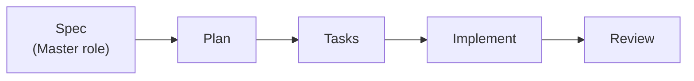
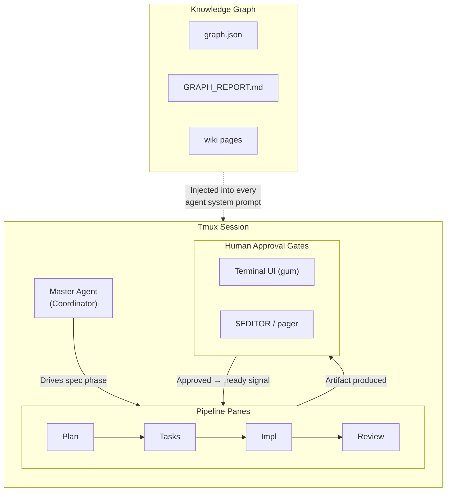
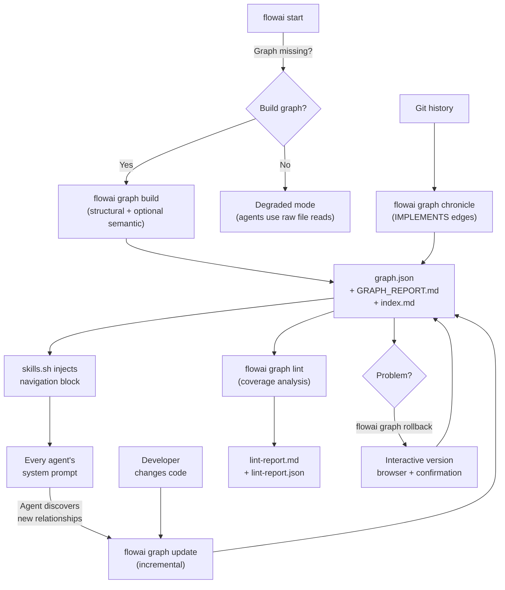

# FlowAI Architecture

FlowAI is built on the Unix philosophy and Domain-Driven Design. The orchestration engine is intentionally decoupled from vendor AI tools — adding a new tool touches only two files. Pipeline phases are defined in a single constant (`src/core/phases.sh`) — adding a new phase requires editing one file.

## Pipeline



Each phase runs in its own tmux pane, waits for the upstream `.ready` signal, invokes the AI, then blocks for human approval before emitting its own `.ready` signal.

The canonical phase list lives in `src/core/phases.sh`:

```bash
readonly FLOWAI_PIPELINE_PHASES=(spec plan tasks impl review)
```

All consumers (`start.sh`, `eventlog.sh`, `bin/flowai`) read from this constant — no hardcoded phase lists exist elsewhere.

## Session Layout



## Knowledge Graph Lifecycle

The knowledge graph is a **cross-cutting concern** that feeds every agent. Here is how it integrates with the pipeline:



### When Each Command Runs

| Command | When | What happens |
|---------|------|--------------|
| `flowai graph build` | First time / `--force` | Full structural scan of `scan_paths`, optional semantic LLM pass, community detection, generates `GRAPH_REPORT.md` |
| `flowai graph update` | After code changes | Incremental — only files with changed SHA256 are reprocessed |
| `flowai graph chronicle` | After commits | Mines git log for `IMPLEMENTS` edges, enriches spec nodes with evolution history |
| `flowai graph lint` | Auditing | Detects unimplemented specs, unspecified code, zombie specs, stale ADRs |
| `flowai graph rollback` | Recovery | Interactive version browser: shows all backups with metadata, danger confirmation before truncation |
| `flowai graph query "..."` | Discovery | Queries the wiki; files answer back as a wiki page |

### How Agents Receive the Graph

`skills.sh` → `flowai_skills_build_prompt()` injects the knowledge graph context block **before** any skill files, so agents see it at the top of their context window:

```
[Role prompt] → [Constitution] → [KNOWLEDGE GRAPH block] → [EVENT LOG] → [Skills]
```

The graph block includes the navigation protocol (read `GRAPH_REPORT.md` → `index.md` → `graph.json` → source files).

## Tool Plugin System

AI tools are self-contained plugins in `src/tools/<name>.sh`. Each plugin defines three functions:

- `flowai_tool_<name>_print_models()` — used by `flowai models list`
- `flowai_tool_<name>_run()` — called by the phase dispatcher in `src/core/ai.sh`
- `flowai_tool_<name>_run_oneshot(model, prompt_file)` — non-interactive single-prompt execution for knowledge graph semantic extraction

The dispatcher uses `declare -F` to resolve functions dynamically — no hardcoded tool list exists. Tools that lack a headless CLI (Cursor, Copilot) return empty JSON fallback from `_run_oneshot`.

Adding a new tool requires only:

1. `src/tools/<name>.sh` with all three plugin functions
2. An entry in `models-catalog.json` with a `default_id` and `models[]` list

Tests `UC-CLI-033`, `TPL-001`, and `TPL-002` enforce this contract on every CI run.

## Signal Coordination

Phases synchronise via marker files in `.flowai/signals/`:

| File | Meaning |
|------|---------|
| `<phase>.ready` | Phase approved; downstream may start |
| `<phase>.reject` | Human rejected; awaiting revision signal |
| `<phase>.revision.ready` | Revision complete; phase retries |

`flowai_phase_wait_for` polls for `.ready` every 2 seconds, respects `SIGINT` (clean exit 130), and enforces `FLOWAI_PHASE_TIMEOUT_SEC` when set.

## Source Layout

```
bin/            flowai, fai
src/
  core/         ai.sh, config.sh, phase.sh, phases.sh, log.sh,
                skills.sh, eventlog.sh, graph.sh, models-catalog.sh
  tools/        gemini.sh, claude.sh, cursor.sh, copilot.sh   ← tool plugins
  phases/       master.sh, spec.sh, plan.sh, tasks.sh, implement.sh, review.sh
  commands/     init.sh, start.sh, graph.sh, models.sh, mcp.sh, skill.sh …
  graph/        build.sh, wiki.sh, lint.sh, chronicle.sh       ← graph engine
  roles/        master.md, backend-engineer.md, reviewer.md, team-lead.md …
  skills/       <skill-name>/SKILL.md
  bootstrap/    specify.sh
models-catalog.json   ← canonical tool + model registry
docs/
  ARCHITECTURE.md     ← this file
  COMMANDS.md         ← CLI reference
  GRAPH.md            ← knowledge graph deep-dive
  TOOLS.md            ← tool plugin reference
```

## Skills & Roles Resolution

### Skill Path — 4 Tiers (first match wins)

| Tier | Location | How registered |
|------|----------|----------------|
| 1 | `.flowai/skills/<name>/SKILL.md` | `flowai skill add` → skills.sh or GitHub download |
| 2 | `<skills.paths[]>/<name>/SKILL.md` | `flowai skill add` → "Local directory" menu option |
| 3 | `$FLOWAI_HOME/src/skills/<name>/SKILL.md` | Ships with FlowAI |
| 4 | _(not found)_ | `log_warn` emitted at prompt-build time |

Tier 2 paths are stored **relative to `$PWD`** in `.flowai/config.json` under `skills.paths[]`:

```jsonc
// .flowai/config.json
{
  "skills": {
    "paths": ["docs/skills"],          // project-relative; committed to the repo
    "role_assignments": { ... }
  }
}
```

### Role Prompt — 5 Tiers (first match wins)

| Tier | Location | How set |
|------|----------|---------|
| 1 | `.flowai/roles/<phase>.md` | File drop by phase name (`plan`, `tasks` …) |
| 2 | `.flowai/roles/<role-name>.md` | File drop by role name (`team-lead`, `reviewer` …) — `flowai role edit` |
| 3 | `<prompt_file>` from `config.json` | `flowai role set-prompt <role> <path>` |
| 4 | `$FLOWAI_HOME/src/roles/<role>.md` | Bundled |
| 5 | `$FLOWAI_HOME/src/roles/backend-engineer.md` | Ultimate fallback |

Tier 1 & 2 are file-drop only — no config.json change needed.
Tier 3 stores a project-relative path (version-controlled, team-visible):

```jsonc
// .flowai/config.json
{
  "roles": {
    "team-lead": {
      "tool": "gemini",
      "model": "gemini-2.5-pro",
      "prompt_file": "docs/roles/team-lead.md"   // relative to $PWD
    }
  }
}
```

## Event Log (Cross-Agent Message Bus)

All pipeline activity is recorded in an append-only JSONL log at `.flowai/events.jsonl`. This gives every agent and the master orchestrator real-time visibility into what has happened, what is blocked, and what has been approved or rejected.

### Event format

```json
{"ts":"2025-04-10T14:30:00Z","phase":"plan","event":"started","detail":""}
```

### Event types

| Event | Meaning |
|-------|---------|
| `waiting` | Phase is blocked, waiting for upstream signal |
| `started` | Phase AI run has begun |
| `artifact_produced` | Phase output file written |
| `approved` | Human approved the artifact |
| `rejected` | Human rejected the artifact (detail has reason) |
| `progress` | Implementation progress (e.g. "3/7 tasks") |
| `phase_complete` | Phase fully done (approved + signal fired) |
| `pipeline_complete` | All phases done |
| `error` | Phase encountered an error |

### Prompt injection

Recent events are automatically injected into every agent's system prompt as a `[PIPELINE EVENT LOG]` block. The format is configurable via `event_log.prompt_format` in `.flowai/config.json`:

| Format | Tokens/event | Description |
|--------|-------------|-------------|
| `compact` (default) | ~8 | Deduplicated progress, short `HH:MM` timestamps |
| `minimal` | ~3 | `phase:event` only — no timestamps or detail |
| `full` | ~20 | Raw JSONL lines, no transformation |

### Atomic writes

Events are written atomically via temp-file + `flock` (Linux) or simple append (macOS) to prevent corruption from concurrent tmux panes.

## Master Agent as Orchestrator

The master agent operates in two phases:

1. **Spec creation** — interactive AI session where the user defines the feature spec
2. **Pipeline monitoring** — after spec approval, enters a loop that:
   - Polls `events.jsonl` every 5 seconds
   - On `rejected` event: re-invokes the master AI with rejection context so it can provide guidance
   - On `pipeline_complete`: breaks the loop and displays a summary
   - Handles `SIGINT` for clean shutdown

### Review rejection & partial re-runs

When the review phase rejects implementation:
1. Review agent writes structured rejection details to `.flowai/signals/impl.rejection_context`
2. On re-run, implement phase reads this context and injects a `[REVIEW REJECTION CONTEXT]` block
3. The implement agent focuses only on the failed items — no full re-implementation

### Progress tracking

During implementation, a background watcher monitors `tasks.md` checkbox counts (`- [x]` vs `- [ ]`) and emits `progress` events every 10 seconds. The master agent and event log consumers see real-time progress like "3/7 tasks complete."

---

## Graph Versioning & Rollback

Every `flowai graph build` and `flowai graph update` creates a timestamped backup of `graph.json` before merging. Retention defaults to 5 (configurable via `graph.versions_to_keep`).

```bash
# Interactive version browser — shows date, node/edge count, size
flowai graph rollback

# Non-interactive — restores the most recent backup (CI/scripts)
flowai graph rollback --latest
```

The interactive flow:
1. **Version table** — lists all backups with metadata (date, nodes, edges, file size)
2. **Selection** — choose which version to restore (gum or plain read)
3. **Danger confirmation** — warns that newer versions will be permanently deleted
4. **Safety net** — always saves a `.pre-rollback` copy before overwriting

See [GRAPH.md](GRAPH.md) for full knowledge graph documentation.

---

## Roadmap

### MCP Integration
Phase agents will query MCP servers for live project context (e.g., TypeScript AST, API schemas) instead of relying on injected text prompts. Configured via `.flowai/config.json` → `mcp.servers`.

### VCS Integration
`flowai run review` will optionally pull CI logs from GitHub Actions / GitLab CI into the Review pane, allowing the agent to iterate on broken commits without human copy-paste.

### Parallel DAG Execution
Currently phases are sequential. A future executor will allow phases to depend on each other in a directed acyclic graph, enabling parallel backend/frontend implementation panes that merge before Review.
